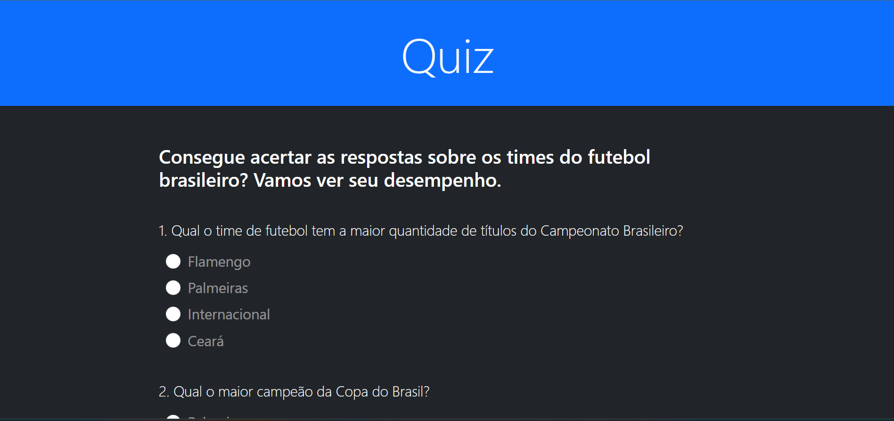

<h1 align="center"> Quiz interativo </h1>

Projeto desenvolvido durante estudos sobre Javascript  

 

  

## 🚀 Tecnologias

Esse projeto foi desenvolvido com as seguintes tecnologias:

- Bootstrap
- JavaScript
- Git e Github

## ✍️ Descrição

Foi usado somente as classes CSS do Bootstrap para fazer estilização. A parte de interação foi toda feita com javascript puro, onde foi trabalhado com:

- Eventos de formulário (envio do form),
- Obtenção de dados do usuário (respostas por meio do input radio),
- Validações de inputs, onde pelo menos uma das alternativas tem que está marcada.
- Manipulação da DOM ( container de amostra da pontuação, animação do scroll)

## 💻 Projeto

É um quiz sobre os times de futebol brasilero, para testar seus conhecimentos sobre o nosso futebol. Onde o usuário tem 10 questões com 4 alternativas de respostas para cada.
E ao fim do questionário após o envio vem a animação de scroll até o topo para visualização da pontuação, tendo uma animação a mais quando é obtido a pontuação máxima.

- [Visite o projeto online](https://quiz-futebolbrasileiro.netlify.app/)
